# SpringBootWeb案例

前面我们已经讲解了Web前端开发的基础知识，也讲解了Web后端开发的基础(HTTP协议、请求响应)，并且也讲解了数据库MySQL，以及通过Mybatis框架如何来完成数据库的基本操作。 那接下来，我们就通过一个案例，来将前端开发、后端开发、数据库整合起来。 而这个案例呢，就是我们前面提到的Tlias智能学习辅助系统。


在这个案例中，前端开发人员已经将前端工程开发完毕了。 我们需要做的，就是参考接口文档完成后端功能的开发，然后结合前端工程进行联调测试即可。


**完成后的成品效果展示：**


> **今天的主要内容如下：**
>
> - 准备工作
> - 部门管理
> - 员工管理


下面我们就进入到今天的第1个内容`准备工作`的学习。


## 1. 准备工作

准备工作的学习，我们先从"需求"和"环境搭建"开始入手。

### 1.1 需求&环境搭建

#### 1.1.1 需求说明

**1、部门管理**


部门管理功能开发包括：

- 查询部门列表
- 删除部门
- 新增部门
- 修改部门


**2、员工管理**


员工管理功能开发包括：

- 查询员工列表(分页、条件)
- 删除员工
- 新增员工
- 修改员工


#### 1.1.2 环境搭建


步骤：

1. 准备数据库表(dept、emp)
2. 创建springboot工程，引入对应的起步依赖（web、mybatis、mysql驱动、lombok）
3. 配置文件application.properties中引入mybatis的配置信息，准备对应的实体类
4. 准备对应的Mapper、Service(接口、实现类)、Controller基础结构


第1步：准备数据库表

~~~mysql
-- 部门管理
create table dept(
    id int unsigned primary key auto_increment comment '主键ID',
    name varchar(10) not null unique comment '部门名称',
    create_time datetime not null comment '创建时间',
    update_time datetime not null comment '修改时间'
) comment '部门表';
-- 部门表测试数据
insert into dept (id, name, create_time, update_time) values(1,'学工部',now(),now()),(2,'教研部',now(),now()),(3,'咨询部',now(),now()), (4,'就业部',now(),now()),(5,'人事部',now(),now());


-- 员工管理(带约束)
create table emp (
  id int unsigned primary key auto_increment comment 'ID',
  username varchar(20) not null unique comment '用户名',
  password varchar(32) default '123456' comment '密码',
  name varchar(10) not null comment '姓名',
  gender tinyint unsigned not null comment '性别, 说明: 1 男, 2 女',
  image varchar(300) comment '图像',
  job tinyint unsigned comment '职位, 说明: 1 班主任,2 讲师, 3 学工主管, 4 教研主管, 5 咨询师',
  entrydate date comment '入职时间',
  dept_id int unsigned comment '部门ID',
  create_time datetime not null comment '创建时间',
  update_time datetime not null comment '修改时间'
) comment '员工表';
-- 员工表测试数据
INSERT INTO emp
	(id, username, password, name, gender, image, job, entrydate,dept_id, create_time, update_time) VALUES
	(1,'jinyong','123456','金庸',1,'1.jpg',4,'2000-01-01',2,now(),now()),
	(2,'zhangwuji','123456','张无忌',1,'2.jpg',2,'2015-01-01',2,now(),now()),
	(3,'yangxiao','123456','杨逍',1,'3.jpg',2,'2008-05-01',2,now(),now()),
	(4,'weiyixiao','123456','韦一笑',1,'4.jpg',2,'2007-01-01',2,now(),now()),
	(5,'changyuchun','123456','常遇春',1,'5.jpg',2,'2012-12-05',2,now(),now()),
	(6,'xiaozhao','123456','小昭',2,'6.jpg',3,'2013-09-05',1,now(),now()),
	(7,'jixiaofu','123456','纪晓芙',2,'7.jpg',1,'2005-08-01',1,now(),now()),
	(8,'zhouzhiruo','123456','周芷若',2,'8.jpg',1,'2014-11-09',1,now(),now()),
	(9,'dingminjun','123456','丁敏君',2,'9.jpg',1,'2011-03-11',1,now(),now()),
	(10,'zhaomin','123456','赵敏',2,'10.jpg',1,'2013-09-05',1,now(),now()),
	(11,'luzhangke','123456','鹿杖客',1,'11.jpg',5,'2007-02-01',3,now(),now()),
	(12,'hebiweng','123456','鹤笔翁',1,'12.jpg',5,'2008-08-18',3,now(),now()),
	(13,'fangdongbai','123456','方东白',1,'13.jpg',5,'2012-11-01',3,now(),now()),
	(14,'zhangsanfeng','123456','张三丰',1,'14.jpg',2,'2002-08-01',2,now(),now()),
	(15,'yulianzhou','123456','俞莲舟',1,'15.jpg',2,'2011-05-01',2,now(),now()),
	(16,'songyuanqiao','123456','宋远桥',1,'16.jpg',2,'2007-01-01',2,now(),now()),
	(17,'chenyouliang','123456','陈友谅',1,'17.jpg',NULL,'2015-03-21',NULL,now(),now());
~~~


第2步：创建一个SpringBoot工程，选择引入对应的起步依赖（web、mybatis、mysql驱动、lombok） (版本选择2.7.5版本，可以创建完毕之后，在pom.xml文件中更改版本号)


 生成的pom.xml文件：

~~~xml
<?xml version="1.0" encoding="UTF-8"?>
<project xmlns="http://maven.apache.org/POM/4.0.0" xmlns:xsi="http://www.w3.org/2001/XMLSchema-instance"
         xsi:schemaLocation="http://maven.apache.org/POM/4.0.0 https://maven.apache.org/xsd/maven-4.0.0.xsd">
    <modelVersion>4.0.0</modelVersion>
    <parent>
        <groupId>org.springframework.boot</groupId>
        <artifactId>spring-boot-starter-parent</artifactId>
        <version>2.7.5</version>
        <relativePath/> 
    </parent>
    <groupId>com.itheima</groupId>
    <artifactId>tlias-web-management</artifactId>
    <version>0.0.1-SNAPSHOT</version>
    <name>tlias-web-management</name>
    <description>Demo project for Spring Boot</description>
    <properties>
        <java.version>11</java.version>
    </properties>
    <dependencies>
        <dependency>
            <groupId>org.springframework.boot</groupId>
            <artifactId>spring-boot-starter-web</artifactId>
        </dependency>
        <dependency>
            <groupId>org.mybatis.spring.boot</groupId>
            <artifactId>mybatis-spring-boot-starter</artifactId>
            <version>2.3.0</version>
        </dependency>

        <dependency>
            <groupId>com.mysql</groupId>
            <artifactId>mysql-connector-j</artifactId>
            <scope>runtime</scope>
        </dependency>
        <dependency>
            <groupId>org.projectlombok</groupId>
            <artifactId>lombok</artifactId>
            <optional>true</optional>
        </dependency>
        <dependency>
            <groupId>org.springframework.boot</groupId>
            <artifactId>spring-boot-starter-test</artifactId>
            <scope>test</scope>
        </dependency>
    </dependencies>

    <build>
        <plugins>
            <plugin>
                <groupId>org.springframework.boot</groupId>
                <artifactId>spring-boot-maven-plugin</artifactId>
                <configuration>
                    <excludes>
                        <exclude>
                            <groupId>org.projectlombok</groupId>
                            <artifactId>lombok</artifactId>
                        </exclude>
                    </excludes>
                </configuration>
            </plugin>
        </plugins>
    </build>

</project>
~~~

创建项目工程目录结构：


第3步：配置文件application.properties中引入mybatis的配置信息，准备对应的实体类

- application.properties （直接把之前项目中的复制过来）

~~~properties
#数据库连接
spring.datasource.driver-class-name=com.mysql.cj.jdbc.Driver
spring.datasource.url=jdbc:mysql://localhost:3306/tlias
spring.datasource.username=root
spring.datasource.password=1234

#开启mybatis的日志输出
mybatis.configuration.log-impl=org.apache.ibatis.logging.stdout.StdOutImpl

#开启数据库表字段 到 实体类属性的驼峰映射
mybatis.configuration.map-underscore-to-camel-case=true
~~~

- 实体类

~~~java
/*部门类*/
@Data
@NoArgsConstructor
@AllArgsConstructor
public class Dept {
    private Integer id;
    private String name;
    private LocalDateTime createTime;
    private LocalDateTime updateTime;
}
~~~

~~~java
/*员工类*/
@Data
@NoArgsConstructor
@AllArgsConstructor
public class Emp {
    private Integer id;
    private String username;
    private String password;
    private String name;
    private Short gender;
    private String image;
    private Short job;
    private LocalDate entrydate;
    private Integer deptId;
    private LocalDateTime createTime;
    private LocalDateTime updateTime;
}
~~~


第4步：准备对应的Mapper、Service(接口、实现类)、Controller基础结构

数据访问层：

- DeptMapper

~~~java
package com.itheima.mapper;
import org.apache.ibatis.annotations.Mapper;

@Mapper
public interface DeptMapper {
}
~~~

- EmpMapper

~~~java
package com.itheima.mapper;
import org.apache.ibatis.annotations.Mapper;

@Mapper
public interface EmpMapper {
}

~~~


业务层：

- DeptService

~~~java
package com.itheima.service;

//部门业务规则
public interface DeptService {
}
~~~

- DeptServiceImpl

~~~java
package com.itheima.service.impl;
import lombok.extern.slf4j.Slf4j;
import org.springframework.stereotype.Service;

//部门业务实现类
@Slf4j
@Service
public class DeptServiceImpl implements DeptService {
}
~~~

- EmpService

~~~java
package com.itheima.service;

//员工业务规则
public interface EmpService {
}
~~~

- EmpServiceImpl

~~~java
package com.itheima.service.impl;
import com.itheima.service.EmpService;
import lombok.extern.slf4j.Slf4j;
import org.springframework.stereotype.Service;

//员工业务实现类
@Slf4j
@Service
public class EmpServiceImpl implements EmpService {

}
~~~


控制层：

- DeptController

~~~java
package com.itheima.controller;
import org.springframework.web.bind.annotation.RestController;

//部门管理控制器
@RestController
public class DeptController {
}
~~~

- EmpController

~~~java
package com.itheima.controller;
import org.springframework.web.bind.annotation.RestController;

//员工管理控制器
@RestController
public class EmpController {
}
~~~

项目工程结构：


### 1.2 开发规范

了解完需求也完成了环境搭建了，我们下面开始学习开发的一些规范。

开发规范我们主要从以下几方面介绍：

**1、开发规范-REST**

我们的案例是基于当前最为主流的前后端分离模式进行开发。


在前后端分离的开发模式中，前后端开发人员都需要根据提前定义好的接口文档，来进行前后端功能的开发。

> 后端开发人员：必须严格遵守提供的接口文档进行后端功能开发（保障开发的功能可以和前端对接）
>
> 


而在前后端进行交互的时候，我们需要基于当前主流的REST风格的API接口进行交互。

什么是REST风格呢?

- REST（Representational State Transfer），表述性状态转换，它是一种软件架构风格。


**传统URL风格如下：**

```url
http://localhost:8080/user/getById?id=1     GET：查询id为1的用户
http://localhost:8080/user/saveUser         POST：新增用户
http://localhost:8080/user/updateUser       POST：修改用户
http://localhost:8080/user/deleteUser?id=1  GET：删除id为1的用户
```

我们看到，原始的传统URL呢，定义比较复杂，而且将资源的访问行为对外暴露出来了。


**基于REST风格URL如下：**

```
http://localhost:8080/users/1  GET：查询id为1的用户
http://localhost:8080/users    POST：新增用户
http://localhost:8080/users    PUT：修改用户
http://localhost:8080/users/1  DELETE：删除id为1的用户
```

其中总结起来，就一句话：通过URL定位要操作的资源，通过HTTP动词(请求方式)来描述具体的操作。


在REST风格的URL中，通过四种请求方式，来操作数据的增删改查。 

- GET ： 查询
- POST ：新增
- PUT ：修改
- DELETE ：删除

我们看到如果是基于REST风格，定义URL，URL将会更加简洁、更加规范、更加优雅。

> 注意事项：
>
> - REST是风格，是约定方式，约定不是规定，可以打破
> - 描述模块的功能通常使用复数，也就是加s的格式来描述，表示此类资源，而非单个资源。如：users、emps、books…


**2、开发规范-统一响应结果**

前后端工程在进行交互时，使用统一响应结果 Result。

~~~java
package com.itheima.pojo;

import lombok.AllArgsConstructor;
import lombok.Data;
import lombok.NoArgsConstructor;

@Data
@NoArgsConstructor
@AllArgsConstructor
public class Result {
    private Integer code;//响应码，1 代表成功; 0 代表失败
    private String msg;  //响应信息 描述字符串
    private Object data; //返回的数据

    //增删改 成功响应
    public static Result success(){
        return new Result(1,"success",null);
    }
    //查询 成功响应
    public static Result success(Object data){
        return new Result(1,"success",data);
    }
    //失败响应
    public static Result error(String msg){
        return new Result(0,msg,null);
    }
}
~~~


**3、开发流程**

我们在进行功能开发时，都是根据如下流程进行：

 

1. 查看页面原型明确需求
   - 根据页面原型和需求，进行表结构设计、编写接口文档(已提供)

2. 阅读接口文档
3. 思路分析
4. 功能接口开发
   - 就是开发后台的业务功能，一个业务功能，我们称为一个接口
5. 功能接口测试
   - 功能开发完毕后，先通过Postman进行功能接口测试，测试通过后，再和前端进行联调测试
6. 前后端联调测试
   - 和前端开发人员开发好的前端工程一起测试


## 2. 部门管理

我们按照前面学习的开发流程，开始完成功能开发。首先按照之前分析的需求，完成`部门管理`的功能开发。

开发的部门管理功能包含：

1. 查询部门
2. 删除部门
3. 新增部门
4. 更新部门（不讲解，自己独立完成）

### 2.1 查询部门

#### 2.1.1 原型和需求


> 查询的部门的信息：部门ID、部门名称、修改时间
>
> 通过页面原型以及需求描述，我们可以看到，部门查询，是不需要考虑分页操作的。


#### 2.1.2 接口文档

**部门列表查询**

- 基本信息

  ~~~
  请求路径：/depts
  
  请求方式：GET
  
  接口描述：该接口用于部门列表数据查询
  ~~~

- 请求参数

  无

- 响应数据

  参数格式：application/json

  参数说明：

  | 参数名         | 类型      | 是否必须 | 备注                           |
  | -------------- | --------- | -------- | ------------------------------ |
  | code           | number    | 必须     | 响应码，1 代表成功，0 代表失败 |
  | msg            | string    | 非必须   | 提示信息                       |
  | data           | object[ ] | 非必须   | 返回的数据                     |
  | \|- id         | number    | 非必须   | id                             |
  | \|- name       | string    | 非必须   | 部门名称                       |
  | \|- createTime | string    | 非必须   | 创建时间                       |
  | \|- updateTime | string    | 非必须   | 修改时间                       |

  响应数据样例：

  ~~~json
  {
    "code": 1,
    "msg": "success",
    "data": [
      {
        "id": 1,
        "name": "学工部",
        "createTime": "2022-09-01T23:06:29",
        "updateTime": "2022-09-01T23:06:29"
      },
      {
        "id": 2,
        "name": "教研部",
        "createTime": "2022-09-01T23:06:29",
        "updateTime": "2022-09-01T23:06:29"
      }
    ]
  }
  ~~~


#### 2.1.3 思路分析


#### 2.1.4 功能开发

通过查看接口文档：部门列表查询

> 请求路径：/depts
>
> 请求方式：GET
>
> 请求参数：无
>
> 响应数据：json格式

**DeptController**

```java
@Slf4j
@RestController
public class DeptController {
    @Autowired
    private DeptService deptService;

    //@RequestMapping(value = "/depts" , method = RequestMethod.GET)
    @GetMapping("/depts")
    public Result list(){
        log.info("查询所有部门数据");
        List<Dept> deptList = deptService.list();
        return Result.success(deptList);
    }
}
```

> @Slf4j注解源码：
>
> 

**DeptService**（业务接口）

```java
public interface DeptService {
    /**
     * 查询所有的部门数据
     * @return   存储Dept对象的集合
     */
    List<Dept> list();
}
```

 **DeptServiceImpl**（业务实现类）

```java
@Slf4j
@Service
public class DeptServiceImpl implements DeptService {
    @Autowired
    private DeptMapper deptMapper;
    
    @Override
    public List<Dept> list() {
        List<Dept> deptList = deptMapper.list();
        return deptList;
    }
}    
```

**DeptMapper**

```java
@Mapper
public interface DeptMapper {
    //查询所有部门数据
    @Select("select id, name, create_time, update_time from dept")
    List<Dept> list();
}
```


#### 2.1.5 功能测试

功能开发完成后，我们就可以启动项目，然后打开postman，发起GET请求，访问 ：http://localhost:8080/depts


### 2.2 前后端联调

完成了查询部门的功能，我们也通过postman工具测试通过了，下面我们再基于前后端分离的方式进行接口联调。具体操作如下：

1、将资料中提供的"前端环境"文件夹中的压缩包，拷贝到一个没有中文不带空格的目录下

 


2、拷贝到一个没有中文不带空格的目录后，进行解压（解压到当前目录）

 


3、启动nginx

 


4、打开浏览器，访问：http://localhost:90


5、测试：部门管理 - 查询部门列表


> 说明：只要按照接口文档开发功能接口，就能保证前后端程序交互
>
> - 后端：严格遵守接口文档进行功能接口开发
> - 前端：严格遵守接口文档访问功能接口


### 2.3 删除部门

查询部门的功能我们搞定了，下面我们开始完成`删除部门`的功能开发。

#### 2.3.1 需求

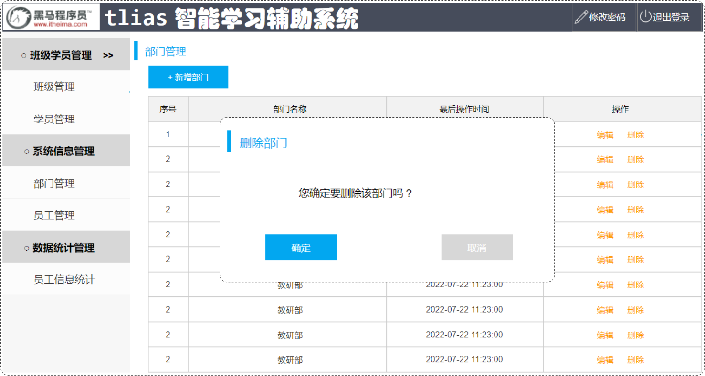

点击部门列表后面操作栏的 "删除" 按钮，就可以删除该部门信息。 此时，前端只需要给服务端传递一个ID参数就可以了。 我们从接口文档中也可以看得出来。


#### 2.3.2 接口文档

**删除部门**

- 基本信息

  ~~~
  请求路径：/depts/{id}
  
  请求方式：DELETE
  
  接口描述：该接口用于根据ID删除部门数据
  ~~~

- 请求参数
  参数格式：路径参数

  参数说明：

  | 参数名 | 类型   | 是否必须 | 备注   |
  | ------ | ------ | -------- | ------ |
  | id     | number | 必须     | 部门ID |

  请求参数样例：

  ~~~
  /depts/1
  ~~~

- 响应数据
  参数格式：application/json

  参数说明：

  | 参数名 | 类型   | 是否必须 | 备注                           |
  | ------ | ------ | -------- | ------------------------------ |
  | code   | number | 必须     | 响应码，1 代表成功，0 代表失败 |
  | msg    | string | 非必须   | 提示信息                       |
  | data   | object | 非必须   | 返回的数据                     |

  响应数据样例：

  ~~~json
  {
      "code":1,
      "msg":"success",
      "data":null
  }
  ~~~


#### 2.3.3 思路分析


> 接口文档规定：
>
> - 前端请求路径：/depts/{id}
> - 前端请求方式：DELETE
>
> 问题1：怎么在controller中接收请求路径中的路径参数？
>
> ~~~
> @PathVariable
> ~~~
>
> 问题2：如何限定请求方式是delete？
>
> ~~~
> @DeleteMapping
> ~~~


#### 2.3.4 功能开发

通过查看接口文档：删除部门

> 请求路径：/depts/{id}
>
> 请求方式：DELETE
>
> 请求参数：路径参数 {id}
>
> 响应数据：json格式

**DeptController**

~~~java
@Slf4j
@RestController
public class DeptController {
    @Autowired
    private DeptService deptService;

    @DeleteMapping("/depts/{id}")
    public Result delete(@PathVariable Integer id) {
        //日志记录
        log.info("根据id删除部门");
        //调用service层功能
        deptService.delete(id);
        //响应
        return Result.success();
    }
    
    //省略...
}
~~~

**DeptService**

~~~java
public interface DeptService {

    /**
     * 根据id删除部门
     * @param id    部门id
     */
    void delete(Integer id);

    //省略...
}
~~~

**DeptServiceImpl**

~~~java
@Slf4j
@Service
public class DeptServiceImpl implements DeptService {
    @Autowired
    private DeptMapper deptMapper;

    @Override
    public void delete(Integer id) {
        //调用持久层删除功能
        deptMapper.deleteById(id);
    }
    
    //省略...
}
~~~

**DeptMapper**

~~~java
@Mapper
public interface DeptMapper {
    /**
     * 根据id删除部门信息
     * @param id   部门id
     */
    @Delete("delete from dept where id = #{id}")
    void deleteById(Integer id);
   
    //省略...
}
~~~


#### 2.3.5 功能测试

删除功能开发完成后，重新启动项目，使用postman，发起DELETE请求：


#### 2.3.6 前后端联调

打开浏览器，测试后端功能接口：

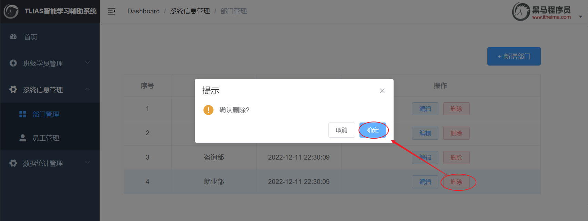


### 2.4 新增部门

我们前面已完成了`查询部门`、`删除部门`两个功能，也熟悉了开发的流程。下面我们继续完成`新增部门`功能。

#### 2.4.1 需求


点击 "新增部门" 按钮，弹出新增部门对话框，输入部门名称，点击 "保存" ，将部门信息保存到数据库。


#### 2.4.2 接口文档

**添加部门**

- 基本信息

  ~~~
  请求路径：/depts
  
  请求方式：POST
  
  接口描述：该接口用于添加部门数据
  ~~~

- 请求参数

  格式：application/json

  参数说明：

  | 参数名 | 类型   | 是否必须 | 备注     |
  | ------ | ------ | -------- | -------- |
  | name   | string | 必须     | 部门名称 |

  请求参数样例：

  ~~~json
  {
  	"name": "教研部"
  }
  ~~~

- 响应数据

  参数格式：application/json

  参数说明：

  | 参数名 | 类型   | 是否必须 | 备注                           |
  | ------ | ------ | -------- | ------------------------------ |
  | code   | number | 必须     | 响应码，1 代表成功，0 代表失败 |
  | msg    | string | 非必须   | 提示信息                       |
  | data   | object | 非必须   | 返回的数据                     |

  响应数据样例：

  ~~~json
  {
      "code":1,
      "msg":"success",
      "data":null
  }
  ~~~


#### 2.4.3 思路分析


> 接口文档规定：
>
> - 前端请求路径：/depts
> - 前端请求方式：POST
> - 前端请求参数 (Json格式)：{ "name": "教研部" }
>
> 问题1：如何限定请求方式是POST？
>
> ~~~java
> @PostMapping
> ~~~
>
> 问题2：怎么在controller中接收json格式的请求参数？
>
> ~~~java
> @RequestBody  //把前端传递的json数据填充到实体类中
> ~~~


#### 2.4.4 功能开发

通过查看接口文档：新增部门

> 请求路径：/depts
>
> 请求方式：POST
>
> 请求参数：json格式 
>
> 响应数据：json格式

**DeptController**

~~~java
@Slf4j
@RestController
public class DeptController {
    @Autowired
    private DeptService deptService;

    @PostMapping("/depts")
    public Result add(@RequestBody Dept dept){
        //记录日志
        log.info("新增部门：{}",dept);
        //调用service层添加功能
        deptService.add(dept);
        //响应
        return Result.success();
    }

    //省略...
}
~~~

**DeptService**

~~~java
public interface DeptService {

    /**
     * 新增部门
     * @param dept  部门对象
     */
    void add(Dept dept);

    //省略...
}

~~~

**DeptServiceImpl**

~~~java
@Slf4j
@Service
public class DeptServiceImpl implements DeptService {
    @Autowired
    private DeptMapper deptMapper;

    @Override
    public void add(Dept dept) {
        //补全部门数据
        dept.setCreateTime(LocalDateTime.now());
        dept.setUpdateTime(LocalDateTime.now());
        //调用持久层增加功能
        deptMapper.inser(dept);
    }

    //省略...
}

~~~

**DeptMapper**

~~~java
@Mapper
public interface DeptMapper {

    @Insert("insert into dept (name, create_time, update_time) values (#{name},#{createTime},#{updateTime})")
    void inser(Dept dept);

    //省略...
}
~~~


#### 2.4.5 功能测试

新增功能开发完成后，重新启动项目，使用postman，发起POST请求：

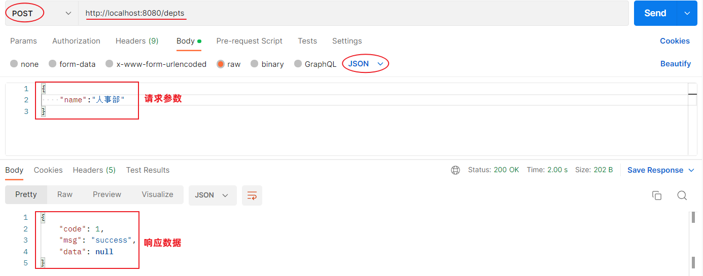


#### 2.4.6 前后端联调

打开浏览器，测试后端功能接口：


#### 2.4.7 请求路径

我们部门管理的`查询`、`删除`、`新增`功能全部完成了，接下来我们要对controller层的代码进行优化。

首先我们先来看下目前controller层代码：


> 以上三个方法上的请求路径，存在一个共同点：都是以`/depts`作为开头。（重复了）

在Spring当中为了简化请求路径的定义，可以把公共的请求路径，直接抽取到类上，在类上加一个注解@RequestMapping，并指定请求路径"/depts"。代码参照如下：

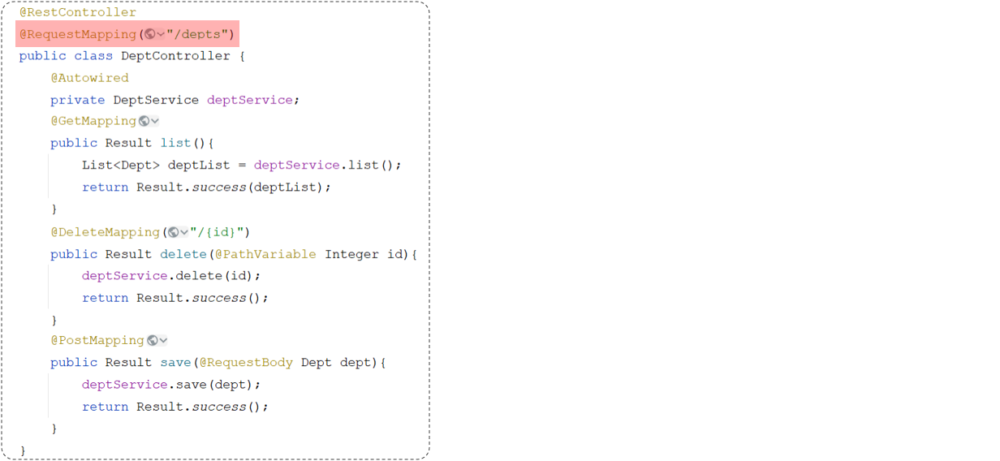

> 优化前后的对比：
>
> 

> 注意事项：一个完整的请求路径，应该是类上@RequestMapping的value属性 + 方法上的 @RequestMapping的value属性


## 3. 员工管理

完成了部门管理的功能开发之后，我们进入到下一环节员工管理功能的开发。


基于以上原型，我们可以把员工管理功能分为：

1. 分页查询（今天完成）
2. 带条件的分页查询（今天完成）
3. 删除员工（今天完成）
4. 新增员工（后续完成）
5. 修改员工（后续完成）

那下面我们就先从分页查询功能开始学习。

### 3.1 分页查询

#### 3.1.1 基础分页

##### 3.1.1.1 需求分析

我们之前做的查询功能，是将数据库中所有的数据查询出来并展示到页面上，试想如果数据库中的数据有很多(假设有十几万条)的时候，将数据全部展示出来肯定不现实，那如何解决这个问题呢？

> 使用分页解决这个问题。每次只展示一页的数据，比如：一页展示10条数据，如果还想看其他的数据，可以通过点击页码进行查询。

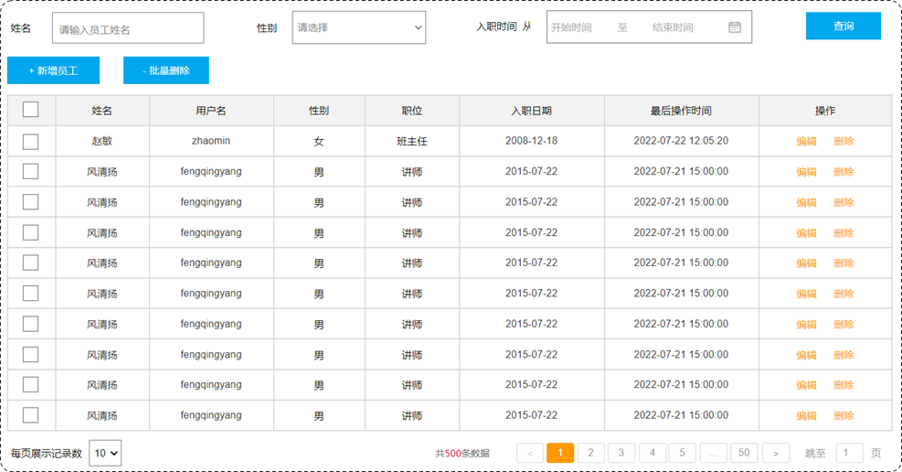

要想从数据库中进行分页查询，我们要使用`LIMIT`关键字，格式为：limit  开始索引  每页显示的条数

> 查询第1页数据的SQL语句是：
>
> ```
> select * from emp  limit 0,10;
> ```
>
> 查询第2页数据的SQL语句是：
>
> ```
> select * from emp  limit 10,10;
> ```
>
> 查询第3页的数据的SQL语句是：
>
> ```
> select * from emp  limit 20,10;
> ```
>
> 观察以上SQL语句，发现： 开始索引一直在改变 ， 每页显示条数是固定的
>
> 开始索引的计算公式：   开始索引 = (当前页码 - 1)  *  每页显示条数

我们继续基于页面原型，继续分析，得出以下结论：

1. 前端在请求服务端时，传递的参数
   - 当前页码  page
   - 每页显示条数  pageSize
2. 后端需要响应什么数据给前端
   - 所查询到的数据列表（存储到List 集合中）
   - 总记录数

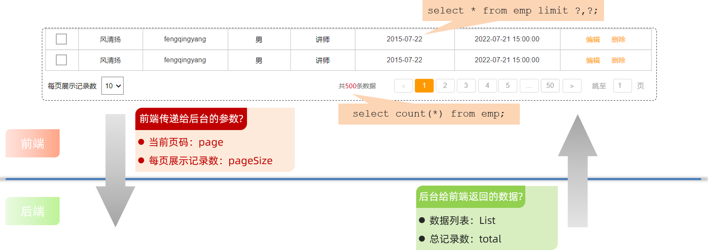

> 后台给前端返回的数据包含：List集合(数据列表)、total(总记录数)
>
> 而这两部分我们通常封装到PageBean对象中，并将该对象转换为json格式的数据响应回给浏览器。
>
> ~~~java
> @Data
> @NoArgsConstructor
> @AllArgsConstructor
> public class PageBean {
>  private Long total; //总记录数
>  private List rows; //当前页数据列表
> }
> ~~~


##### 3.1.1.2 接口文档

**员工列表查询**

- 基本信息

  ~~~
  请求路径：/emps
  
  请求方式：GET
  
  接口描述：该接口用于员工列表数据的条件分页查询
  ~~~

- 请求参数

  参数格式：queryString

  参数说明：

  | 参数名称 | 是否必须 | 示例       | 备注                                       |
  | -------- | -------- | ---------- | ------------------------------------------ |
  | name     | 否       | 张         | 姓名                                       |
  | gender   | 否       | 1          | 性别 , 1 男 , 2 女                         |
  | begin    | 否       | 2010-01-01 | 范围匹配的开始时间(入职日期)               |
  | end      | 否       | 2020-01-01 | 范围匹配的结束时间(入职日期)               |
  | page     | 是       | 1          | 分页查询的页码，如果未指定，默认为1        |
  | pageSize | 是       | 10         | 分页查询的每页记录数，如果未指定，默认为10 |

  请求数据样例：

  ~~~shell
  /emps?name=张&gender=1&begin=2007-09-01&end=2022-09-01&page=1&pageSize=10
  ~~~

- 响应数据

  参数格式：application/json

  参数说明：

  | 名称           | 类型      | 是否必须 | 默认值 | 备注                                                         | 其他信息          |
  | -------------- | --------- | -------- | ------ | ------------------------------------------------------------ | ----------------- |
  | code           | number    | 必须     |        | 响应码, 1 成功 , 0 失败                                      |                   |
  | msg            | string    | 非必须   |        | 提示信息                                                     |                   |
  | data           | object    | 必须     |        | 返回的数据                                                   |                   |
  | \|- total      | number    | 必须     |        | 总记录数                                                     |                   |
  | \|- rows       | object [] | 必须     |        | 数据列表                                                     | item 类型: object |
  | \|- id         | number    | 非必须   |        | id                                                           |                   |
  | \|- username   | string    | 非必须   |        | 用户名                                                       |                   |
  | \|- name       | string    | 非必须   |        | 姓名                                                         |                   |
  | \|- password   | string    | 非必须   |        | 密码                                                         |                   |
  | \|- entrydate  | string    | 非必须   |        | 入职日期                                                     |                   |
  | \|- gender     | number    | 非必须   |        | 性别 , 1 男 ; 2 女                                           |                   |
  | \|- image      | string    | 非必须   |        | 图像                                                         |                   |
  | \|- job        | number    | 非必须   |        | 职位, 说明: 1 班主任,2 讲师, 3 学工主管, 4 教研主管, 5 咨询师 |                   |
  | \|- deptId     | number    | 非必须   |        | 部门id                                                       |                   |
  | \|- createTime | string    | 非必须   |        | 创建时间                                                     |                   |
  | \|- updateTime | string    | 非必须   |        | 更新时间                                                     |                   |

  响应数据样例：

  ~~~json
  {
    "code": 1,
    "msg": "success",
    "data": {
      "total": 2,
      "rows": [
         {
          "id": 1,
          "username": "jinyong",
          "password": "123456",
          "name": "金庸",
          "gender": 1,
          "image": "https://web-framework.oss-cn-hangzhou.aliyuncs.com/2022-09-02-00-27-53B.jpg",
          "job": 2,
          "entrydate": "2015-01-01",
          "deptId": 2,
          "createTime": "2022-09-01T23:06:30",
          "updateTime": "2022-09-02T00:29:04"
        },
        {
          "id": 2,
          "username": "zhangwuji",
          "password": "123456",
          "name": "张无忌",
          "gender": 1,
          "image": "https://web-framework.oss-cn-hangzhou.aliyuncs.com/2022-09-02-00-27-53B.jpg",
          "job": 2,
          "entrydate": "2015-01-01",
          "deptId": 2,
          "createTime": "2022-09-01T23:06:30",
          "updateTime": "2022-09-02T00:29:04"
        }
      ]
    }
  }
  ~~~


##### 3.1.1.3 思路分析


分页查询需要的数据，封装在PageBean对象中：


##### 3.1.1.4 功能开发

通过查看接口文档：员工列表查询

> 请求路径：/emps
>
> 请求方式：GET
>
> 请求参数：跟随在请求路径后的参数字符串。  例：/emps?page=1&pageSize=10
>
> 响应数据：json格式

**EmpController**

~~~java
import com.itheima.pojo.PageBean;
import com.itheima.pojo.Result;
import com.itheima.service.EmpService;
import lombok.extern.slf4j.Slf4j;
import org.springframework.beans.factory.annotation.Autowired;
import org.springframework.web.bind.annotation.GetMapping;
import org.springframework.web.bind.annotation.RequestMapping;
import org.springframework.web.bind.annotation.RequestParam;
import org.springframework.web.bind.annotation.RestController;

@Slf4j
@RestController
@RequestMapping("/emps")
public class EmpController {

    @Autowired
    private EmpService empService;

    //条件分页查询
    @GetMapping
    public Result page(@RequestParam(defaultValue = "1") Integer page,
                       @RequestParam(defaultValue = "10") Integer pageSize) {
        //记录日志
        log.info("分页查询，参数：{},{}", page, pageSize);
        //调用业务层分页查询功能
        PageBean pageBean = empService.page(page, pageSize);
        //响应
        return Result.success(pageBean);
    }
}
~~~

> @RequestParam(defaultValue="默认值")   //设置请求参数默认值


**EmpService**

~~~java
public interface EmpService {
    /**
     * 条件分页查询
     * @param page 页码
     * @param pageSize 每页展示记录数
     * @return
     */
    PageBean page(Integer page, Integer pageSize);
}
~~~

**EmpServiceImpl**

~~~java
import com.itheima.mapper.EmpMapper;
import com.itheima.pojo.Emp;
import com.itheima.pojo.PageBean;
import com.itheima.service.EmpService;
import lombok.extern.slf4j.Slf4j;
import org.springframework.beans.factory.annotation.Autowired;
import org.springframework.stereotype.Service;
import java.time.LocalDate;
import java.util.List;

@Slf4j
@Service
public class EmpServiceImpl implements EmpService {
    @Autowired
    private EmpMapper empMapper;

    @Override
    public PageBean page(Integer page, Integer pageSize) {
        //1、获取总记录数
        Long count = empMapper.count();

        //2、获取分页查询结果列表
        Integer start = (page - 1) * pageSize; //计算起始索引 , 公式: (页码-1)*页大小
        List<Emp> empList = empMapper.list(start, pageSize);

        //3、封装PageBean对象
        PageBean pageBean = new PageBean(count , empList);
        return pageBean;
    }
}
~~~

**EmpMapper**

~~~java
@Mapper
public interface EmpMapper {
    //获取总记录数
    @Select("select count(*) from emp")
    public Long count();

    //获取当前页的结果列表
    @Select("select * from emp limit #{start}, #{pageSize}")
    public List<Emp> list(Integer start, Integer pageSize);
}
~~~


##### 3.1.1.5 功能测试

功能开发完成后，重新启动项目，使用postman，发起POST请求：


##### 3.1.1.6 前后端联调

打开浏览器，测试后端功能接口：


#### 3.1.2 分页插件

##### 3.1.2.1 介绍

前面我们已经完了基础的分页查询，大家会发现：分页查询功能编写起来比较繁琐。


> 在Mapper接口中定义两个方法执行两条不同的SQL语句：
>
> 1. 查询总记录数
> 2. 指定页码的数据列表
>
> 在Service当中，调用Mapper接口的两个方法，分别获取：总记录数、查询结果列表，然后在将获取的数据结果封装到PageBean对象中。
>
> 大家思考下：在未来开发其他项目，只要涉及到分页查询功能(例：订单、用户、支付、商品)，都必须按照以上操作完成功能开发

结论：原始方式的分页查询，存在着"步骤固定"、"代码频繁"的问题

解决方案：可以使用一些现成的分页插件完成。对于Mybatis来讲现在最主流的就是PageHelper。


> PageHelper是Mybatis的一款功能强大、方便易用的分页插件，支持任何形式的单标、多表的分页查询。
>
> 官网：https://pagehelper.github.io/

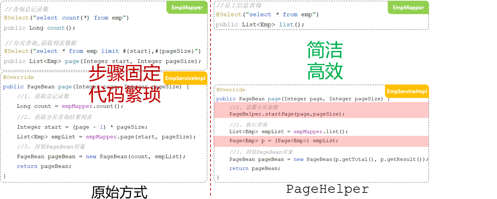

> 在执行empMapper.list()方法时，就是执行：select  *  from  emp   语句，怎么能够实现分页操作呢？
>
> 分页插件帮我们完成了以下操作：
>
> 1. 先获取到要执行的SQL语句：select  *  from  emp      
> 2. 把SQL语句中的字段列表，变为：count(*)
> 3. 执行SQL语句：select  count(*)  from  emp          //获取到总记录数
> 4. 再对要执行的SQL语句：select  *  from  emp 进行改造，在末尾添加 limit ? , ?
> 5. 执行改造后的SQL语句：select  *  from  emp  limit  ? , ? 


##### 3.1.2.2 代码实现

**(此处跑不通，代码有问题)**

当使用了PageHelper分页插件进行分页，就无需再Mapper中进行手动分页了。 在Mapper中我们只需要进行正常的列表查询即可。在Service层中，调用Mapper的方法之前设置分页参数，在调用Mapper方法执行查询之后，解析分页结果，并将结果封装到PageBean对象中返回。

1、在pom.xml引入依赖

```xml
<dependency>
    <groupId>com.github.pagehelper</groupId>
    <artifactId>pagehelper-spring-boot-starter</artifactId>
    <version>1.4.2</version>
</dependency>
```

2、EmpMapper

```java
@Mapper
public interface EmpMapper {
    //获取当前页的结果列表
    @Select("select * from emp")
    public List<Emp> page(Integer start, Integer pageSize);
}
```

3、EmpServiceImpl

```java
@Override
public PageBean page(Integer page, Integer pageSize) {
    // 设置分页参数
    PageHelper.startPage(page, pageSize); 
    // 执行分页查询
    List<Emp> empList = empMapper.list(name,gender,begin,end); 
    // 获取分页结果
    Page<Emp> p = (Page<Emp>) empList;   
    //封装PageBean
    PageBean pageBean = new PageBean(p.getTotal(), p.getResult()); 
    return pageBean;
}
```

##### 3.1.2.3 测试

功能开发完成后，我们重启项目工程，打开postman，发起GET请求，访问 ：http://localhost:8080/emps?page=1&pageSize=5


> 后端程序SQL输出：
>
> 


### 3.2 分页查询(带条件)

完了分页查询后，下面我们需要在分页查询的基础上，添加条件。

#### 3.2.1 需求

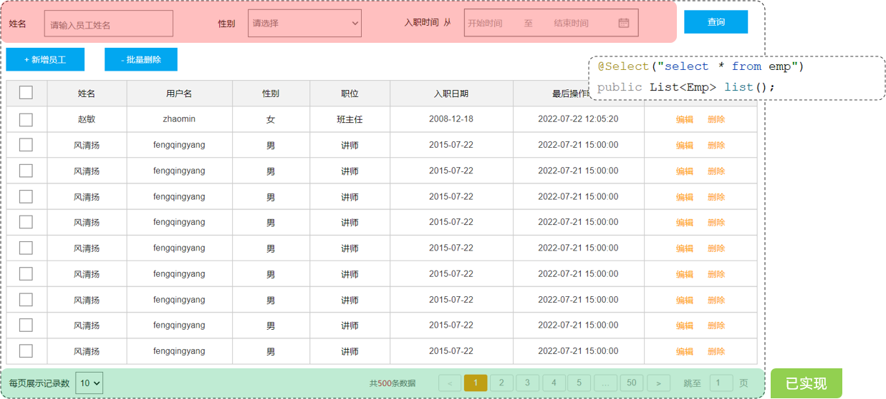

通过员工管理的页面原型我们可以看到，员工列表页面的查询，不仅仅需要考虑分页，还需要考虑查询条件。 分页查询我们已经实现了，接下来，我们需要考虑在分页查询的基础上，再加上查询条件。

我们看到页面原型及需求中描述，搜索栏的搜索条件有三个，分别是：

- 姓名：模糊匹配
- 性别：精确匹配
- 入职日期：范围匹配

~~~mysql
select * 
from emp
where 
  name like concat('%','张','%')   -- 条件1：根据姓名模糊匹配
  and gender = 1                   -- 条件2：根据性别精确匹配
  and entrydate = between '2000-01-01' and '2010-01-01'  -- 条件3：根据入职日期范围匹配
order by update_time desc;
~~~

而且上述的三个条件，都是可以传递，也可以不传递的，也就是动态的。 我们需要使用前面学习的Mybatis中的动态SQL 。


#### 3.2.2 思路分析


#### 3.2.3 功能开发

通过查看接口文档：员工列表查询

> 请求路径：/emps
>
> 请求方式：GET
>
> 请求参数：
>
> | 参数名称 | 是否必须 | 示例       | 备注                                       |
> | -------- | -------- | ---------- | ------------------------------------------ |
> | name     | 否       | 张         | 姓名                                       |
> | gender   | 否       | 1          | 性别 , 1 男 , 2 女                         |
> | begin    | 否       | 2010-01-01 | 范围匹配的开始时间(入职日期)               |
> | end      | 否       | 2020-01-01 | 范围匹配的结束时间(入职日期)               |
> | page     | 是       | 1          | 分页查询的页码，如果未指定，默认为1        |
> | pageSize | 是       | 10         | 分页查询的每页记录数，如果未指定，默认为10 |


在原有分页查询的代码基础上进行改造：

**EmpController**

~~~java
@Slf4j
@RestController
@RequestMapping("/emps")
public class EmpController {

    @Autowired
    private EmpService empService;

    //条件分页查询
    @GetMapping
    public Result page(@RequestParam(defaultValue = "1") Integer page,
                       @RequestParam(defaultValue = "10") Integer pageSize,
                       String name, Short gender,
                       @DateTimeFormat(pattern = "yyyy-MM-dd") LocalDate begin,
                       @DateTimeFormat(pattern = "yyyy-MM-dd") LocalDate end) {
        //记录日志
        log.info("分页查询，参数：{},{},{},{},{},{}", page, pageSize,name, gender, begin, end);
        //调用业务层分页查询功能
        PageBean pageBean = empService.page(page, pageSize, name, gender, begin, end);
        //响应
        return Result.success(pageBean);
    }
}
~~~

**EmpService**

~~~java
public interface EmpService {
    /**
     * 条件分页查询
     * @param page     页码
     * @param pageSize 每页展示记录数
     * @param name     姓名
     * @param gender   性别
     * @param begin   开始时间
     * @param end     结束时间
     * @return
     */
    PageBean page(Integer page, Integer pageSize, String name, Short gender, LocalDate begin, LocalDate end);
}
~~~

**EmpServiceImpl**

~~~java
@Slf4j
@Service
public class EmpServiceImpl implements EmpService {
    @Autowired
    private EmpMapper empMapper;

    @Override
    public PageBean page(Integer page, Integer pageSize, String name, Short gender, LocalDate begin, LocalDate end) {
        //设置分页参数
        PageHelper.startPage(page, pageSize);
        //执行条件分页查询
        List<Emp> empList = empMapper.list(name, gender, begin, end);
        //获取查询结果
        Page<Emp> p = (Page<Emp>) empList;
        //封装PageBean
        PageBean pageBean = new PageBean(p.getTotal(), p.getResult());
        return pageBean;
    }
}
~~~

**EmpMapper**

~~~java
@Mapper
public interface EmpMapper {
    //获取当前页的结果列表
    public List<Emp> list(String name, Short gender, LocalDate begin, LocalDate end);
}
~~~

**EmpMapper.xml**

~~~xml
<?xml version="1.0" encoding="UTF-8" ?>
<!DOCTYPE mapper
        PUBLIC "-//mybatis.org//DTD Mapper 3.0//EN"
        "http://mybatis.org/dtd/mybatis-3-mapper.dtd">
<mapper namespace="com.itheima.mapper.EmpMapper">

    <!-- 条件分页查询 -->
    <select id="list" resultType="com.itheima.pojo.Emp">
        select * from emp
        <where>
            <if test="name != null and name != ''">
                name like concat('%',#{name},'%')
            </if>
            <if test="gender != null">
                and gender = #{gender}
            </if>
            <if test="begin != null and end != null">
                and entrydate between #{begin} and #{end}
            </if>
        </where>
        order by update_time desc
    </select>
</mapper>
~~~


#### 3.2.4 功能测试

功能开发完成后，重启项目工程，打开postman，发起GET请求：


> 控制台SQL语句：
>
> 


#### 3.2.5 前后端联调

打开浏览器，测试后端功能接口：

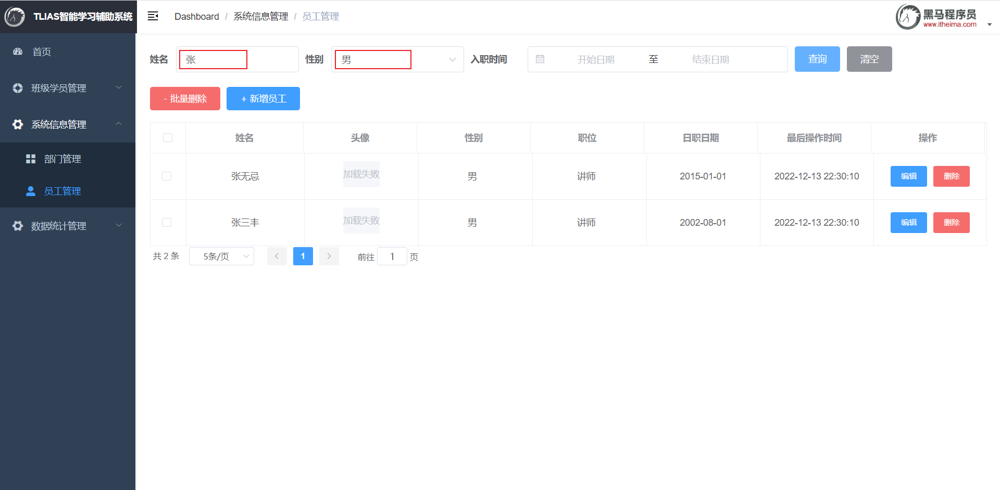


### 3.3 删除员工

查询员完成之后，我们继续开发新的功能：删除员工。

#### 3.3.1 需求

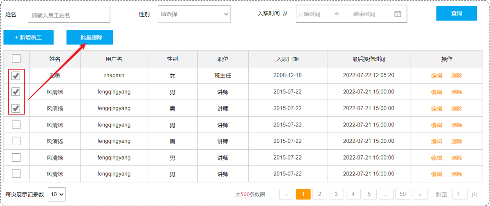

当我们勾选列表前面的复选框，然后点击 "批量删除" 按钮，就可以将这一批次的员工信息删除掉了。也可以只勾选一个复选框，仅删除一个员工信息。

问题：我们需要开发两个功能接口吗？一个删除单个员工，一个删除多个员工

答案：不需要。 只需要开发一个功能接口即可（删除多个员工包含只删除一个员工）


#### 3.3.2 接口文档

**删除员工**

- 基本信息

  ~~~
  请求路径：/emps/{ids}
  
  请求方式：DELETE
  
  接口描述：该接口用于批量删除员工的数据信息
  ~~~

- 请求参数

  参数格式：路径参数

  参数说明：

  | 参数名 | 类型       | 示例  | 是否必须 | 备注         |
  | ------ | ---------- | ----- | -------- | ------------ |
  | ids    | 数组 array | 1,2,3 | 必须     | 员工的id数组 |

  请求参数样例：

  ~~~
  /emps/1,2,3
  ~~~

- 响应数据

  参数格式：application/json

  参数说明：

  | 参数名 | 类型   | 是否必须 | 备注                           |
  | ------ | ------ | -------- | ------------------------------ |
  | code   | number | 必须     | 响应码，1 代表成功，0 代表失败 |
  | msg    | string | 非必须   | 提示信息                       |
  | data   | object | 非必须   | 返回的数据                     |

  响应数据样例：

  ~~~json
  {
      "code":1,
      "msg":"success",
      "data":null
  }
  ~~~

  

#### 3.3.3 思路分析


> 接口文档规定：
>
> - 前端请求路径：/emps/{ids}
> - 前端请求方式：DELETE
>
> 问题1：怎么在controller中接收请求路径中的路径参数？
>
> ~~~
> @PathVariable
> ~~~
>
> 问题2：如何限定请求方式是delete？
>
> ~~~
> @DeleteMapping
> ~~~
>
> 问题3：在Mapper接口中，执行delete操作的SQL语句时，条件中的id值是不确定的是动态的，怎么实现呢？
>
> ~~~
> Mybatis中的动态SQL：foreach
> ~~~


#### 3.3.4 功能开发

通过查看接口文档：删除员工

> 请求路径：/emps/{ids}
>
> 请求方式：DELETE
>
> 请求参数：路径参数 {ids}
>
> 响应数据：json格式

**EmpController**

~~~java
@Slf4j
@RestController
@RequestMapping("/emps")
public class EmpController {

    @Autowired
    private EmpService empService;

    //批量删除
    @DeleteMapping("/{ids}")
    public Result delete(@PathVariable List<Integer> ids){
        empService.delete(ids);
        return Result.success();
    }

    //条件分页查询
    @GetMapping
    public Result page(@RequestParam(defaultValue = "1") Integer page,
                       @RequestParam(defaultValue = "10") Integer pageSize,
                       String name, Short gender,
                       @DateTimeFormat(pattern = "yyyy-MM-dd") LocalDate begin,
                       @DateTimeFormat(pattern = "yyyy-MM-dd") LocalDate end) {
        //记录日志
        log.info("分页查询，参数：{},{},{},{},{},{}", page, pageSize,name, gender, begin, end);
        //调用业务层分页查询功能
        PageBean pageBean = empService.page(page, pageSize, name, gender, begin, end);
        //响应
        return Result.success(pageBean);
    }
}
~~~

**EmpService**

~~~java
public interface EmpService {

    /**
     * 批量删除操作
     * @param ids id集合
     */
    void delete(List<Integer> ids);

    //省略...
}
~~~

**EmpServiceImpl**

~~~java
@Slf4j
@Service
public class EmpServiceImpl implements EmpService {
    @Autowired
    private EmpMapper empMapper;

    @Override
    public void delete(List<Integer> ids) {
        empMapper.delete(ids);
    }

    //省略...
}
~~~

**EmpMapper**

~~~java
@Mapper
public interface EmpMapper {
    //批量删除
    void delete(List<Integer> ids);

    //省略...
}
~~~

**EmpMapper.xml**

~~~xml
<?xml version="1.0" encoding="UTF-8" ?>
<!DOCTYPE mapper
        PUBLIC "-//mybatis.org//DTD Mapper 3.0//EN"
        "http://mybatis.org/dtd/mybatis-3-mapper.dtd">
<mapper namespace="com.itheima.mapper.EmpMapper">

    <!--批量删除员工-->
    <select id="delete">
        delete from emp where id in
        <foreach collection="ids" item="id" open="(" close=")" separator=",">
            #{id}
        </foreach>
    </select>

    <!-- 省略... -->

</mapper>
~~~


#### 3.3.5 功能测试

功能开发完成后，重启项目工程，打开postman，发起DELETE请求：


> 控制台SQL语句：
>
> 


#### 3.3.6 前后端联调

打开浏览器，测试后端功能接口：


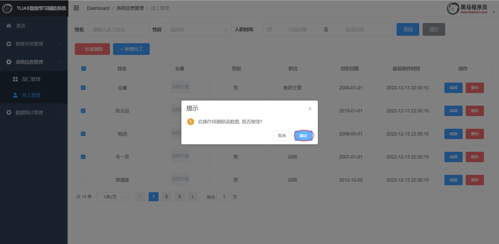


